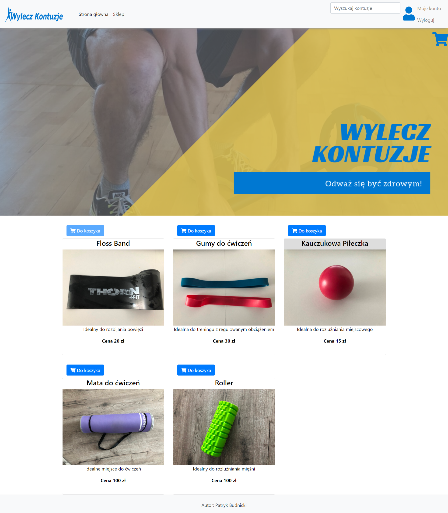

# Aplikacja pierwszej pomocy dla osób kontuzjowanych

Użytkownik w celu korzystania ze wszystkich możliwości aplikacji musi się zalogować lub wykorzystać utworzone już wcześniej konta:

administratora: admin@admin.pl admin123

użytkownika: user@user.pl user123

## Strona główna w widoku deskstopowym

## Strona główna w widoku mobilnym

1. Menu, które jest zawsze przy górnej krawędzi przeglądarki. Stworzone zostało z gotowych elementów bootstrapa 4. Efekt przyczepienia do góry ekranu został uzyskany poprzez nadanie klasy fixed-top. Początkowo menu miało być ustawione pod banerem i dopiero po zescrollowaniu strony na odpowiednią odległość miało przyczepiać się do góry ekranu, za pomocą klasy sticky-top, lecz nie jest ona wspierana przez większość przeglądarek i autor zrezygnował z tego rozwiązania.

2. Wyszukiwarka kontuzji (zob. Rysunek 14). Użytkownik może wyszukać informacje na temat swojego urazu, wpisując miejsce bólu. Aplikacja porównuje ciąg znaków wprowadzony przez użytkownika z kontuzjami opisanymi w aplikacji.

3. Koszyk, po kliknięciu na niego, użytkownik zostanie przekierowany do strony na której znajdują się wszystkie produkty, które dodał do koszyka. Jest on umiejscowiony zawsze przy górnej krawędzi przeglądarki, zaraz pod menu. Za koszykiem znajduje się baner, który jest responsywny poprzez nadanie klasy img-fluid. Oznacza to, że jego rozmiar będzie dostosowywał się do rozmiaru okna przeglądarki.

4. Tekst wprowadzający, krótki opis problemu kontuzji oraz przedstawienie do czego służy Aplikacja pierwszej pomocy dla osób kontuzjowanych.

5. Manekin (zob. Rysunek 15), który służy do wyszukiwania kontuzji. Użytkownik najeżdżając kursorem na miejsce, które go boli spowoduje podświetlenie się całego mięśnia oraz wyświetlenie jego nazwy. Po kliknięciu w bolący mięsień w miejscu modułu <router-outlet>, który aktualnie wyświetlał stronę główną, zostanie pokazana strona opisująca w jaki sposób zwalczyć wybrany uraz. Do narysowania obrysów mięśni został wykorzystany SVG, dzięki niemu zmniejszając, czy też zwiększając okno przeglądarki, zaznaczony obszar powiększa się wraz z obrazem.

## Strona opisująca uraz

1. Opis kontuzji oraz instrukcja dla użytkownika, w jakiej kolejności powinien wykonywać następujące czynności

2. Film nagrany przez autora aplikacji, na którym fizjoterapeuta omawia w jaki sposób wykonywać ćwiczenia, które pomogą w szybszej regeneracji urazu

3. W przypadku zalogowanego użytkownika, możliwość dodania kontuzji, do listy swoich kontuzji

4. Produkty proponowane dla użytkownika, które umożliwią wykonywanie ćwiczeń pokazanych na filmie. Wybranie opcji dodaj do koszyka spowoduje wyświetlenie komunikatu o poprawnym dodaniu (zob. Rysunek 19). Zawartość koszyka dostępna jest po kliknięciu na ikonę koszyka znajdującą się pod menu. Każde kliknięcie przycisku „dodaj do koszyka”, powoduje obniżenie ilości produktów w magazynie, w momencie gdy ilość produktów w magazynie będzie wynosiła 0, przycisk będzie zablokowany (zob. Rysunek 20), a po najechaniu na niego zostanie wyświetlony komunikat, o braku produktów w magazynie

5. Odnośnik do produktu, po kliknięciu na wybrany produkt, użytkownik zostanie przekierowany na stronę, na której uzyska szczegółowe informacje na jego temat. Przy najechaniu myszką na wybrany produkt, zostaje on podświetlony (zob. Rysunek 21).

## sklep

Widok sklepu zależy od rozdzielczości przeglądarki na jakiej jest on wyświetlany, na urządzeniach mobilnych, każdy produkt będzie ustawiony jeden pod drugim, aby polepszyć czytelność dla użytkownika. Znajdują się tutaj wszystkie produkty, które użytkownik może kupić. Po najechaniu na wybrany produkt, użytkownik dostanie więcej informacji na jego temat.

## administrator

Administrator posiada możliwość edycji każdego z elementów produktu, może również zmieniać jego ilość w magazynie.

Administrator posiada również możliwość dodawania nowych użytkowników, wyświetlenia listy wszystkich zarejestrowanych użytkowników, usuwania wybranych użytkowników, czy też zmianę ich danych do logowania (zob. Rysunek 25). Lista użytkowników pobierana jest z wirtualnej bazy danych za pomocą funkcji getUsers().

## użytkownik

Użytkownik po wejściu na podstronę „konto” (zob. Rysunek 26) posiada możliwośd przeglądania swoich kontuzji oraz modyfikacji danych, które podał podczas rejestracji.

Run `ng serve` for a dev server. Navigate to `http://localhost:4200/`. The app will automatically reload if you change any of the source files.

## Code scaffolding

Run `ng generate component component-name` to generate a new component. You can also use `ng generate directive|pipe|service|class|guard|interface|enum|module`.

## Build

Run `ng build` to build the project. The build artifacts will be stored in the `dist/` directory. Use the `--prod` flag for a production build.

## Running unit tests

Run `ng test` to execute the unit tests via [Karma](https://karma-runner.github.io).

## Running end-to-end tests

Run `ng e2e` to execute the end-to-end tests via [Protractor](http://www.protractortest.org/).

## Further help

To get more help on the Angular CLI use `ng help` or go check out the [Angular CLI README](https://github.com/angular/angular-cli/blob/master/README.md).
